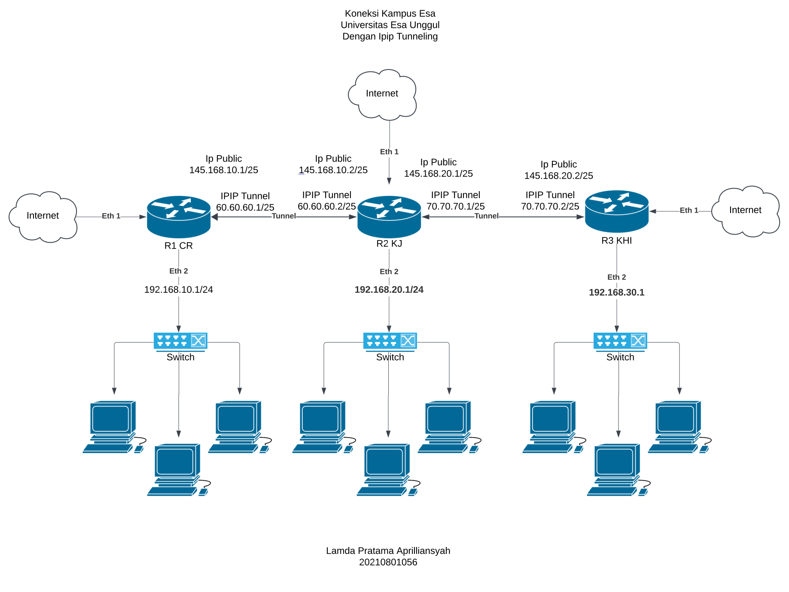

# Lamda Pratama Aprilliansyah (20210801056)

# Essay
1. Routing Static merupakan jenis teknik routing jaringan yang bersifat statis dan dikonfigurasi manual oleh administrator jaringan. Dalam static routing, rute ditambahkan secara manual ke tabel routing pada router, dan kelebihannya termasuk keamanan yang lebih tinggi dan penggunaan bandwidth yang lebih efisien. Namun kekurangannya yaitu lebih rumit karena perlu konfigurasi secara manual.

2. Routing Dynamic merupakan teknik jaringan di mana router secara otomatis menentukan dan memperbarui jalur optimal untuk transmisi paket data dalam jaringan. Teknik ini didasarkan pada perubahan kondisi jaringan secara real-time. Kelebihannya lebih mudah untuk mengkonfigurasi. Lebih efektif dalam memilih rute terbaik dalam merespon perubahan kondisi atau topologi. Sementara itu untuk kekurangannya yaitu lebih mahal dalam hal penggunaan CPU dan bandwidth serta kurang aman dibandingkan dengan perutean default dan statis.

3. Firewall merupakan sistem keamanan yang bertujuan melindungi jaringan komputer dari berbagai ancaman eksternal, seperti virus, malware, dan serangan peretas. Pada prinsipnya, firewall berfungsi sebagai penghalang yang membatasi akses antara jaringan internal yang aman dan jaringan eksternal yang dianggap kurang aman.

4. NAT, atau Network Address Translation, merupakan teknologi yang berfungsi untuk memetakan alamat IP, memungkinkan jaringan lokal (LAN) untuk terhubung ke Internet menggunakan satu alamat IP publik yang sama.

# Cased

# Topologi

# Konfigurasi
Routher 1 (CR)
1. Hubungkan router ke internet dengan dhcp Client

2. Tambahkan Ip address:
   Ether 2: 192.168.10.1/24 -> ip1  
   IPIP Tunnel: 60.60.60.1/25 -> ip2

3. Lakukan DHCP Server untuk Ether 2

Router 2 (KJ)
1. Hubungkan router ke internet dengan dhcp Client

2. Tambahkan Ip address:
   Ether 2: 192.168.20.1/24 -> ip1  
   IPIP Tunnel: 60.60.60.2/25 -> ip2  
   IPIP Tunnel: 70.70.70.1/25 -> ip3

3. Lakukan DHCP Server untuk Ether 2

Router 3 (KHI) 

1. Hrouter ke internet dengan dhcp Client

2. Tambahkan Ip address:
   Ether 2: 192.168.30.1/24 -> ip1  
   IPIP Tunnel: 70.70.70.2 -> ip2

3. Buat Dhcp Server untuk Ether 2

# Konfigurasi IPIP

Routher 1 (CR)
1. Tambahkan interface ip tunnel 1
Local address : 145.168.10.1  
Remote Address R2 : 145.168.10.2

2. Tambahkan interface ip tunnel 2
Local address : 145.168.10.1  
Remote Address R2 : 145.168.20.2

Router 2 (KJ)
1. Tambahkan interface ip tunnel 1
Local address : 145.168.10.2  
Remote Address R1 : 145.168.10.1

2. Tambahkan interface ip tunnel 2
Local address : 145.168.20.1  
Remote Address R3: 145.168.20.2

Router 3 (KHI) 
1. Tambahkan interface ip tunnel 1
Local address : 145.168.20.2  
Remote Address R1 : 145.168.10.1

2. Tambahkan interface ip tunnel 2
Local address : 145.168.20.2  
Remote Address R2: 145.168.20.1

# Konfigurasi routing

Router 2 (KJ)

1. routes 1:
destination address 192.168.20.0/24  
gateway 60.60.60.2

2. routes 2:
destination address 192.168.30.0/24  
gateway 70.70.70.2

Router 2 (KJ)

1. routes 1:
destination address 192.168.10.0/24  
gateway 60.60.60.1

2. routes 2:
destination address 192.168.3.0/24  
gateway 70.70.70.2

Router 3 (KHI)

1. routes 1:
dst address 192.168.10.0/24  
gateway 60.60.60.1

2. routes 2:
dst address 192.168.20.0/24  
gateway 70.70.70.1

# Analisis
1. Gambaran umum 
Ketiga router (R1 CR, R2 KJ, dan R3 KHI) terhubung melalui IP-in-IP (IPIP) tunneling, yang menciptakan koneksi pribadi virtual antar situs melalui Internet publik.

2.  Pengalamatan IP Publik dan Privat
IP Publik diberikan pada setiap interface router yang terhubung ke Internet:  
R1 CR: 145.168.10.1/25  
R2 KJ: 145.168.10.2/25  
R3 KHI: 145.168.20.2/25  
Subnet IP Privat diberikan untuk jaringan internal di setiap lokasi:  
R1 CR: 192.168.10.0/24  
R2 KJ: 192.168.20.0/24  
R3 KHI: 192.168.30.0/24       
Subnet privat ini terhubung ke beberapa komputer atau perangkat melalui switch di masing-masing lokasi.

3. Konfigurasi IPIP Tunneling
Tunneling IPIP dibuat antara:  
R1 CR dan R2 KJ dengan endpoint tunnel 60.60.60.1/25 dan 60.60.60.2/25  
R2 KJ dan R3 KHI dengan endpoint tunnel 70.70.70.1/25 dan 70.70.70.2/25  
Tunneling ini memungkinkan komunikasi aman antar jaringan internal di ketiga lokasi melalui Internet publik, yang berfungsi sebagai Virtual Private Network (VPN).

4. Kesimpulan
Konfigurasi ini menyediakan cara yang sederhana dan efisien untuk menghubungkan kampus yang berbeda, memungkinkan mereka berbagi sumber daya sambil mempertahankan pemisahan jaringan internal. Peningkatan lebih lanjut dalam keamanan dan redundansi dapat memperkuat jaringan ini.